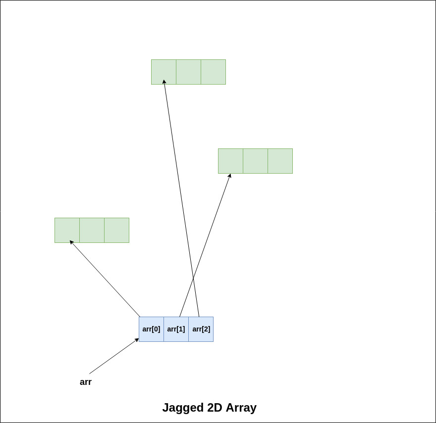

### Let's say you want to represent a `3 * 3` matrix using an array in C. Here are some fashions that you can apply:

### Static 2D Array

- Create Array:
```c
int arr[3][3] = {
    {0, 1, 0},
    {0, 0, 1},
    {0, 1, 0}
  };
```
- Traverse Array:
```c
for (int i = 0; i < 3; i++) {
  for (int j = 0; j < 3; j++) {
    printf("%d ", arr[i][j]);
  }
  printf("\n");
}
```
- Free Array:
```c
// No need to worry about, as it's created on the stack.
```

- Pros:
  - Easy to initialize and use.
  - No dynamic memory allocation required.

- Cons:
  - Limited by stack size (usually signaficantly smaller than heap), not suitable for large arrays.
  - Fixed size, less flexible for varying data.

### Jagged 2D Array (Dynamic)

- Create Array:
```c
int cols = 3, rows = 3;
int **arr;

arr = (int **)malloc(rows * sizeof(int*));
for (int i = 0; i < rows; i++){
  arr[i] = (int *)malloc(cols * sizeof(int));
}
```
- Traverse Array:
```c
for (int i = 0; i < rows; i++) {
  for (int j = 0; j < cols; j++) {
    printf("%d ", arr[i][j]);
  }
  printf("\n");
}
```
- Free Array:
```c
for (int i = 0; i < rows; i++) {
  free(arr[i]);
}
free(arr);
```

- Pros:
  - Flexible sizes for each row.
  - Suitable for complex data structures (like where the size of each row is not uniform).

- Cons:
  - Requires careful memory management.
  - Jagged 2D array is **not** stored contiguously in memory, so it has cache locality issues if you care about performance. 

### VLA Dynamic 2D Array
- Create Array:
```c
int rows = 3, cols = 3;
int (*arr)[cols] = malloc(rows * sizeof(*arr));
```
- Traverse Array:
```c
for (int i = 0; i < rows; i++) {
  for (int j = 0; j < cols; j++) {
    printf("%d ", arr[i][j]);
  }
  printf("\n");
}
```
- Free Array:
```c
free(arr);
```

- Pros:
  - Allows dynamic allocation with variable sizes at runtime.
  - Easier to handle than a jagged array.
- Cons:
  - Not supported in all C standards. (VLA is a feature after C99).

### 1D Array Simulation

- Create Array:
```c
int rows = 3, cols = 3;
int *arr = malloc(rows * cols * sizeof(int));
```
- Traverse Array:
```c
for (int i = 0; i < rows; i++) {
  for (int j = 0; j < cols; j++) {
    printf("%d ", arr[i * cols + j]);
  }
  printf("\n");
}
```
- Free Array:
```c
free(arr);
```
- Pros:
  - Simulates 2D arrays with simple memory management.
  - Flexible for dynamic size adjustments.
- Cons:
  - Accessing elements can be less intuitive.


### Reference:
- [CppReference: C99 variable length arrays](https://en.cppreference.com/w/c/language/array#Variable-length_arrays)